# 导航部分

## 启动导航

配置navigation 2参数,把默认的nav2参数复制到工作空间

```bash
 cp /opt/ros/humble/share/nav2_bringup/params/nav2_params.yaml src/student_starter_kit/config/
```

launch文件中使用`nav2_bringup`里的启动文件，会加快我们的导航启动速度

```bash
(ros2) airsim@AIPhy:/home/qinghe/ros2_ws$ cd /opt/ros/humble/share/nav2_bringup/rviz/
(ros2) airsim@AIPhy:/opt/ros/humble/share/nav2_bringup/rviz$ ls -l
total 32
-rw-r--r-- 1 root root 18303 Nov 18 01:56 nav2_default_view.rviz
-rw-r--r-- 1 root root 12002 Nov 18 01:56 nav2_namespaced_view.rviz
```

在launch文件中修改：

```bash
    nav2_bringup_dir = get_package_share_directory('nav2_bringup')
    rviz_config_dir = os.path.join(
        nav2_bringup_dir, 'rviz', 'nav2_default_view.rviz')
        
        ......
  launch.actions.IncludeLaunchDescription(
            PythonLaunchDescriptionSource(
                [nav2_bringup_dir, '/launch', '/bringup_launch.py']),
```

启动导航

```bash
conda activate ros2
cd /ros2-demo_ws
source install/setup.sh
ros2 launch student_starter_kit navigation.launch.py 
```

全局代价地图开关

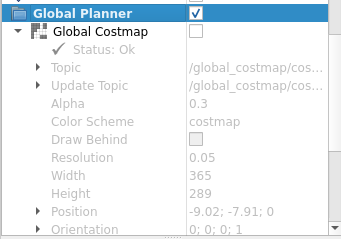

没开

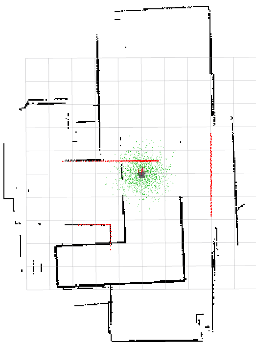

开了

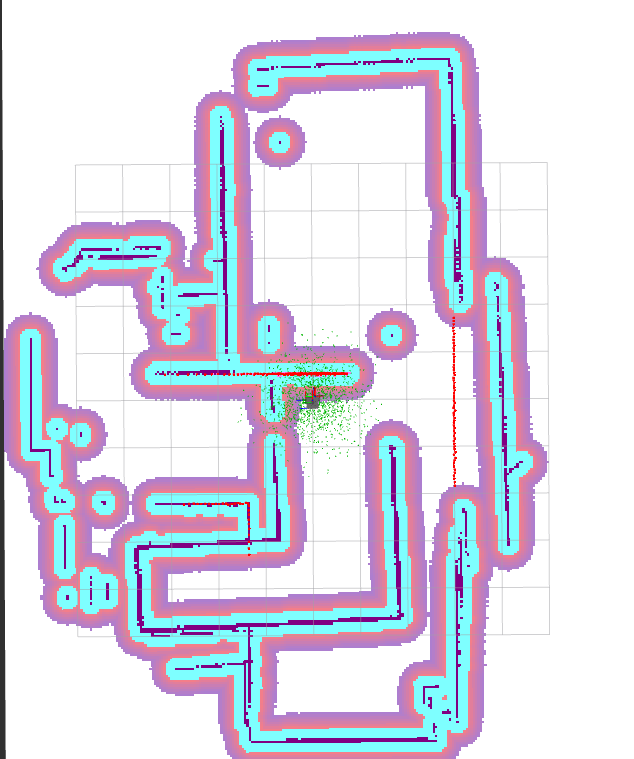

局部代价地图开关

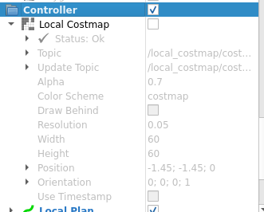

没开

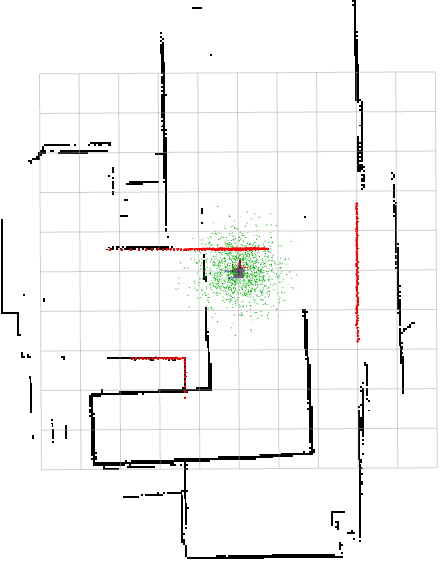

开了

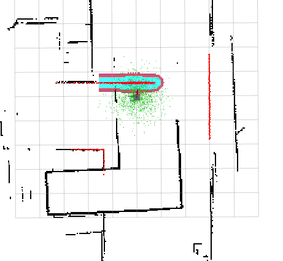


一开始会报tf错误

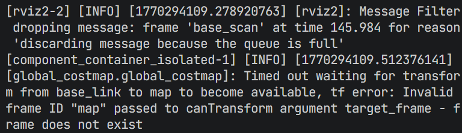

需要给机器人一个大概的位置，amcl会基于这个位置做大概的估计

在rviz中，选择2D Pose Estimate来标定位置

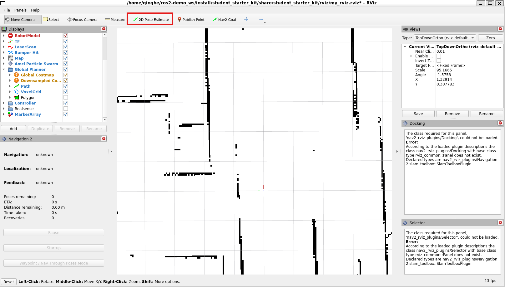

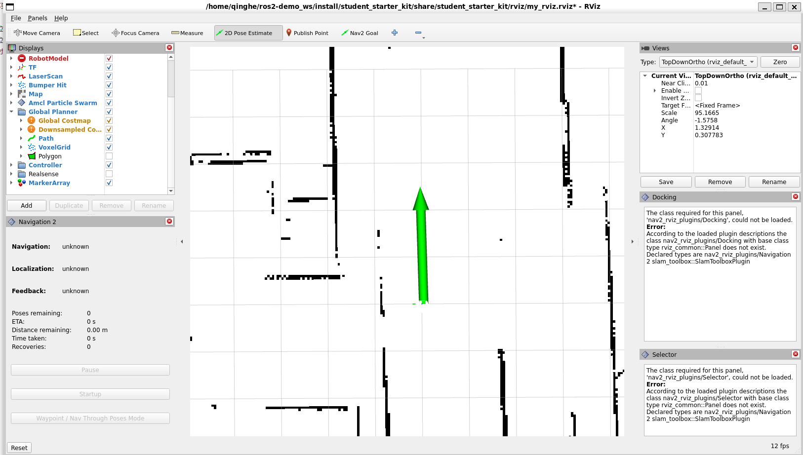

## 在RViz中导航

### 单点导航

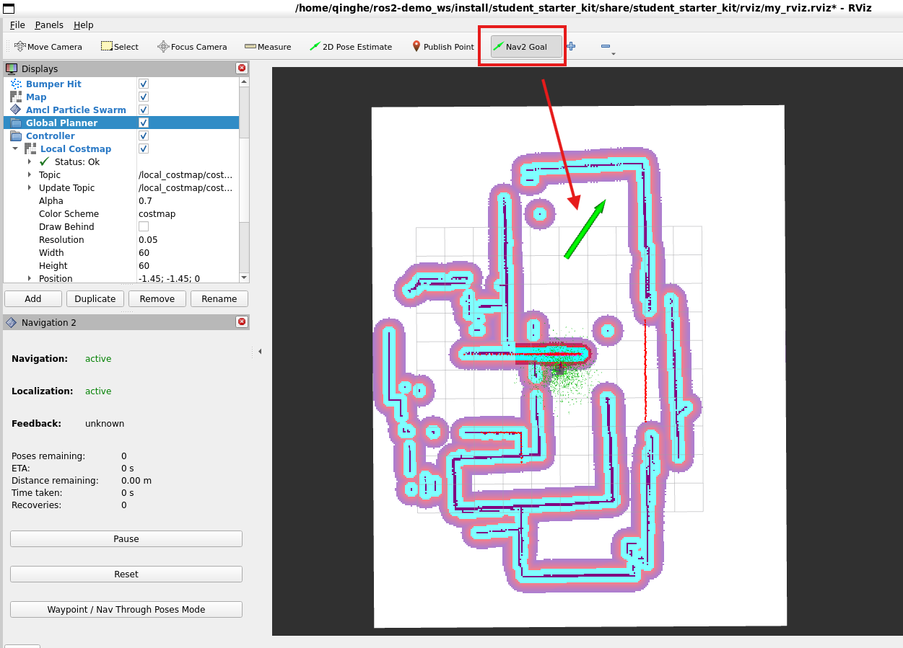

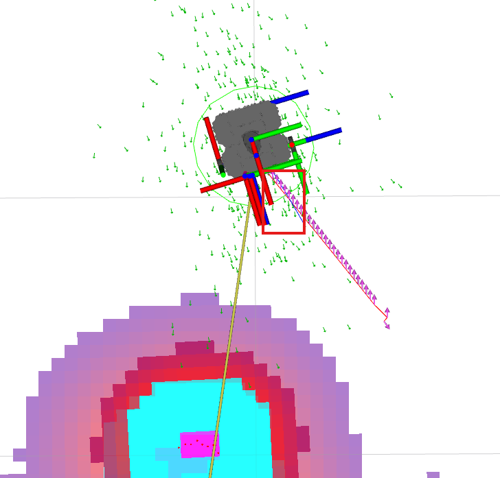


其中，蓝色的线是局部规划路径

### 多点导航

通过这个插件可以取消导航任务，也可以设置多个目标点的导航，点击最下面的 Waypoint/Nav Through Poses Mode ，接着使用 Nav2 Goal 依次设置多个路点，比如下图中设置了五个路点，让机器人绕过咖啡桌再到左前方的目标点。

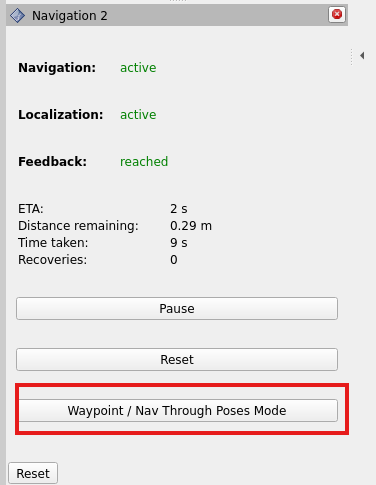

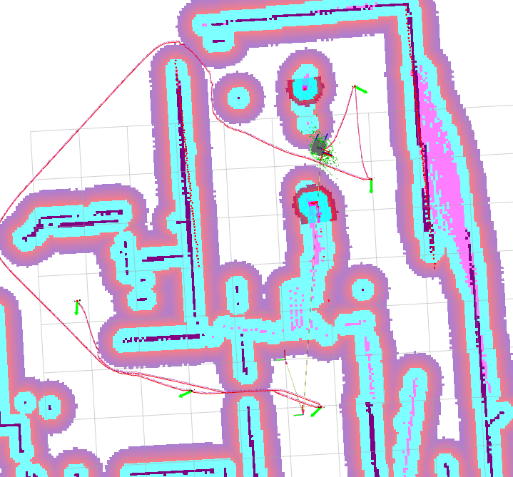

### 动态避障

在gazebo中放置一个圆柱，机器人导航的过程中，看到方块会动态规划路径。

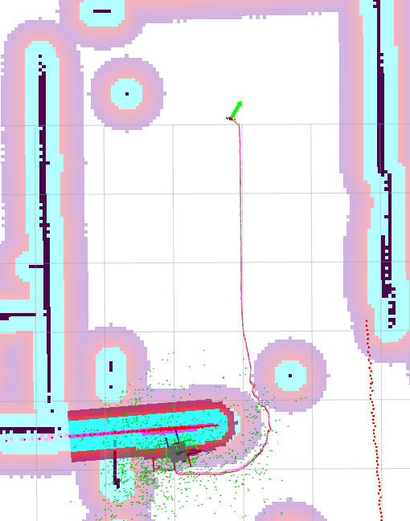

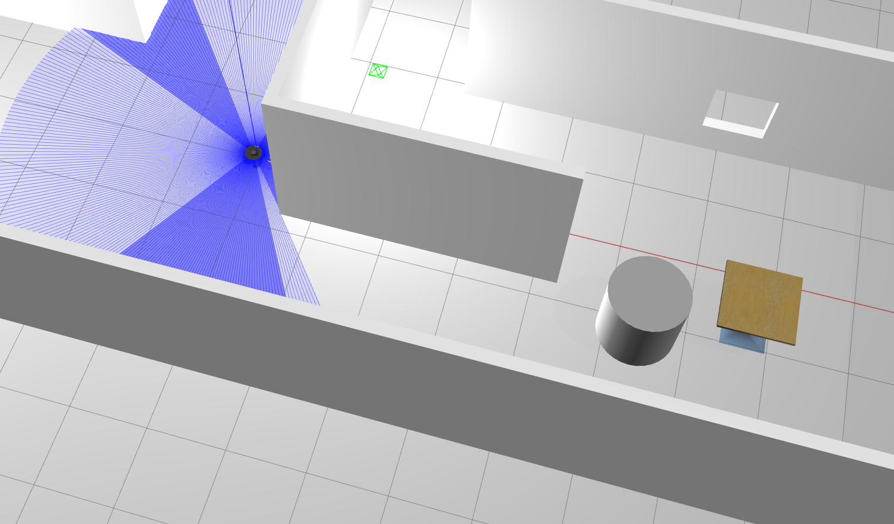

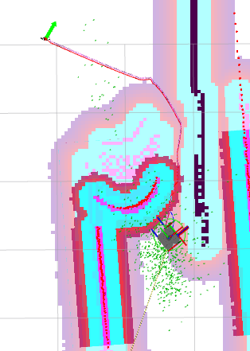

路线变了

## 使用话题初始化机器人的位置信息

查看节点

```bash
ros2 node info /amcl
/amcl
  Subscribers:
    /bond: bond/msg/Status
    /clock: rosgraph_msgs/msg/Clock
    /initialpose: geometry_msgs/msg/PoseWithCovarianceStamped # # 用于接受初始化未知的信息，直接向这个话题发布数据
    /map: nav_msgs/msg/OccupancyGrid
    /parameter_events: rcl_interfaces/msg/ParameterEvent
    /scan: sensor_msgs/msg/LaserScan
  Publishers:
    /amcl/transition_event: lifecycle_msgs/msg/TransitionEvent
    /amcl_pose: geometry_msgs/msg/PoseWithCovarianceStamped
    /bond: bond/msg/Status
    /parameter_events: rcl_interfaces/msg/ParameterEvent
    /particle_cloud: nav2_msgs/msg/ParticleCloud
    /rosout: rcl_interfaces/msg/Log
    /tf: tf2_msgs/msg/TFMessage
  Service Servers:
    /amcl/change_state: lifecycle_msgs/srv/ChangeState
    /amcl/describe_parameters: rcl_interfaces/srv/DescribeParameters
    /amcl/get_available_states: lifecycle_msgs/srv/GetAvailableStates
    /amcl/get_available_transitions: lifecycle_msgs/srv/GetAvailableTransitions
    /amcl/get_parameter_types: rcl_interfaces/srv/GetParameterTypes
    /amcl/get_parameters: rcl_interfaces/srv/GetParameters
    /amcl/get_state: lifecycle_msgs/srv/GetState
    /amcl/get_transition_graph: lifecycle_msgs/srv/GetAvailableTransitions
    /amcl/list_parameters: rcl_interfaces/srv/ListParameters
    /amcl/set_parameters: rcl_interfaces/srv/SetParameters
    /amcl/set_parameters_atomically: rcl_interfaces/srv/SetParametersAtomically
    /reinitialize_global_localization: std_srvs/srv/Empty
    /request_nomotion_update: std_srvs/srv/Empty
    /set_initial_pose: nav2_msgs/srv/SetInitialPose
  Service Clients:

  Action Servers:

  Action Clients:

```

在gazebo中，查看机器人在物理坐标系的位置

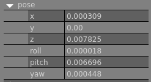

使用命令行发布数据

```bash
ros2 topic pub /initialpose geometry_msgs/msg/PoseWithCovarianceStamped "{header: {frame_id: 'map'}}" --once
##usage
--once 代表只发布一次

```

发布结果

```bash
ros2 topic pub /initialpose geometry_msgs/msg/PoseWithCovarianceStamped "{header: {frame_id: 'map'}}" --once
publisher: beginning loop
publishing #1: geometry_msgs.msg.PoseWithCovarianceStamped(header=std_msgs.msg.Header(stamp=builtin_interfaces.msg.Time(sec=0, nanosec=0), frame_id='map'), pose=geometry_msgs.msg.PoseWithCovariance(pose=geometry_msgs.msg.Pose(position=geometry_msgs.msg.Point(x=0.0, y=0.0, z=0.0), orientation=geometry_msgs.msg.Quaternion(x=0.0, y=0.0, z=0.0, w=1.0)), covariance=array([0., 0., 0., 0., 0., 0., 0., 0., 0., 0., 0., 0., 0., 0., 0., 0., 0.,
       0., 0., 0., 0., 0., 0., 0., 0., 0., 0., 0., 0., 0., 0., 0., 0., 0.,
       0., 0.])))
```

打开rviz，发现机器人已经初始化完成

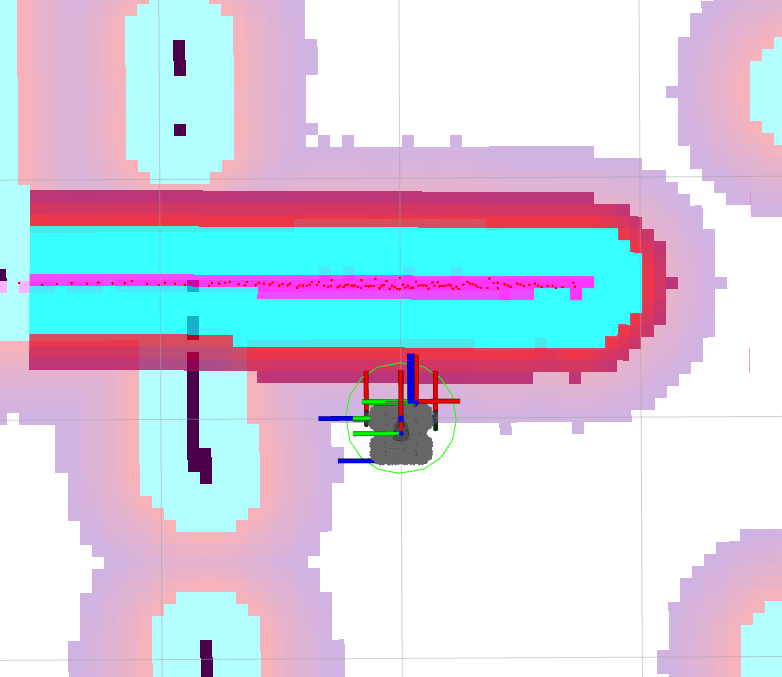


## 使用话题初始化机器人位姿

编写`init_pose.py`

```bash
from geometry_msgs.msg import PoseStamped
from nav2_simple_commander.robot_navigator import BasicNavigator
import rclpy


def main():
    rclpy.init()
    navigator = BasicNavigator()
    initial_pose = PoseStamped()
    initial_pose.header.frame_id = 'map'
    initial_pose.header.stamp = navigator.get_clock().now().to_msg()
    initial_pose.pose.position.x = 0.0
    initial_pose.pose.position.y = 0.0
    initial_pose.pose.orientation.w = 1.0
    navigator.setInitialPose(initial_pose)
    navigator.waitUntilNav2Active()
    rclpy.spin(navigator)
    rclpy.shutdown()

if __name__ == '__main__':
    main()
```

在`setup.py`中添加可执行文件

```bash
    entry_points={
        'console_scripts': [
            'init_pose = app.init_pose:main',
            
        ],
    },
```

启动

```bash
conda activate ros2
cd /ros2-demo_ws
source install/setup.sh
ros2 run student_starter_kit init_pose 
```

部分日志

```bash
ros2 run student_starter_kit init_pose 
[INFO] [1773736514.389364959] [basic_navigator]: Publishing Initial Pose
[INFO] [1773736516.121607050] [basic_navigator]: Setting initial pose
[INFO] [1773736516.122061410] [basic_navigator]: Publishing Initial Pose
[INFO] [1773736516.122383543] [basic_navigator]: Waiting for amcl_pose to be received
[INFO] [1773736516.122963912] [basic_navigator]: Setting initial pose
[INFO] [1773736516.123241642] [basic_navigator]: Publishing Initial Pose
[INFO] [1773736516.123587113] [basic_navigator]: Waiting for amcl_pose to be received
[INFO] [1773736516.123821928] [basic_navigator]: Setting initial pose
[INFO] [1773736516.124081713] [basic_navigator]: Publishing Initial Pose
[INFO] [1773736516.124345021] [basic_navigator]: Waiting for amcl_pose to be received
[INFO] [1773736518.131357781] [basic_navigator]: Nav2 is ready for use!
```

##  使用TF获取机器人的实时位置

编写`get_pose.py`

```bash
import rclpy
from rclpy.node import Node
from tf2_ros import TransformListener, Buffer
from tf_transformations import euler_from_quaternion


class TFListener(Node):

    def __init__(self):
        super().__init__('tf2_listener')
        self.buffer = Buffer()
        self.listener = TransformListener(self.buffer, self)
        self.timer = self.create_timer(1, self.get_transform)

    def get_transform(self):
        try:
            tf = self.buffer.lookup_transform(
                'map', 'base_footprint', rclpy.time.Time(seconds=0), rclpy.time.Duration(seconds=1))
            transform = tf.transform
            rotation_euler = euler_from_quaternion([
                transform.rotation.x,
                transform.rotation.y,
                transform.rotation.z,
                transform.rotation.w
            ])
            self.get_logger().info(
                f'平移:{transform.translation},旋转四元数:{transform.rotation}:旋转欧拉角:{rotation_euler}\n')
        except Exception as e:
            self.get_logger().warn(f'不能够获取坐标变换，原因: {str(e)}')


def main():
    rclpy.init()
    node = TFListener()
    rclpy.spin(node)
    rclpy.shutdown()


if __name__ == '__main__':
    main()
```

启动

```bash
 ros2 run student_starter_kit get_pose 
```

结果

```bash
 ros2 run student_starter_kit get_pose 
[WARN] [1773736610.233588849] [tf2_listener]: 不能够获取坐标变换，原因: "map" passed to lookupTransform argument target_frame does not exist. 
[WARN] [1773736611.252465321] [tf2_listener]: 不能够获取坐标变换，原因: "map" passed to lookupTransform argument target_frame does not exist. 

[INFO] [1773736614.297043216] [tf2_listener]: 平移:geometry_msgs.msg.Vector3(x=0.002508296625350322, y=6.255069366564888e-06, z=1.2909499452040674e-05),旋转四元数:geometry_msgs.msg.Quaternion(x=-1.089724180507742e-05, y=-2.846339711850197e-06, z=0.002349842724179158, w=0.9999972390523486):旋转欧拉角:(-2.180780034012696e-05, -5.641450097801871e-06, 0.00469968983527079)

[INFO] [1773736615.195006376] [tf2_listener]: 平移:geometry_msgs.msg.Vector3(x=0.0026094278580411946, y=6.6639958904479485e-06, z=3.0285999815653566e-05),旋转四元数:geometry_msgs.msg.Quaternion(x=-7.295575604177853e-06, y=1.612088964502082e-06, z=0.0024447753563787344, w=0.9999970115043507):旋转欧拉角:(-1.4583225212612784e-05, 3.2598403804636087e-06, 0.004889555559885128)

```

此时tf树如下：

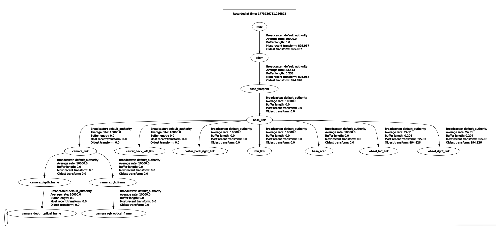


## 调用接口进行单点导航

查看动作节点

```bash
 ros2 action list -t
/assisted_teleop [nav2_msgs/action/AssistedTeleop]
/backup [nav2_msgs/action/BackUp]
/compute_path_through_poses [nav2_msgs/action/ComputePathThroughPoses]
/compute_path_to_pose [nav2_msgs/action/ComputePathToPose]
/drive_on_heading [nav2_msgs/action/DriveOnHeading]
/follow_path [nav2_msgs/action/FollowPath]
/follow_waypoints [nav2_msgs/action/FollowWaypoints]
/navigate_through_poses [nav2_msgs/action/NavigateThroughPoses]
/navigate_to_pose [nav2_msgs/action/NavigateToPose] ## 此服务用于处理导航到点的请求
/smooth_path [nav2_msgs/action/SmoothPath]
/spin [nav2_msgs/action/Spin]
/wait [nav2_msgs/action/Wait]
```

查看`nav2_msgs/action/NavigateToPose`接口的内容

```bash
ros2 interface  show nav2_msgs/action/NavigateToPose
```

详细信息如下

```bash
ros2 interface  show nav2_msgs/action/NavigateToPose
#goal definition  客户端发给服务端的目标
geometry_msgs/PoseStamped pose
        std_msgs/Header header
                builtin_interfaces/Time stamp
                        int32 sec
                        uint32 nanosec
                string frame_id
        Pose pose
                Point position
                        float64 x
                        float64 y
                        float64 z
                Quaternion orientation
                        float64 x 0
                        float64 y 0
                        float64 z 0
                        float64 w 1
string behavior_tree
---
#result definition
std_msgs/Empty result
---
#feedback definition 服务端给客户端的反馈
geometry_msgs/PoseStamped current_pose
        std_msgs/Header header
                builtin_interfaces/Time stamp
                        int32 sec
                        uint32 nanosec
                string frame_id
        Pose pose
                Point position
                        float64 x
                        float64 y
                        float64 z
                Quaternion orientation
                        float64 x 0
                        float64 y 0
                        float64 z 0
                        float64 w 1
builtin_interfaces/Duration navigation_time
        int32 sec
        uint32 nanosec
builtin_interfaces/Duration estimated_time_remaining
        int32 sec
        uint32 nanosec
int16 number_of_recoveries
float32 distance_remaining
```

发送一个动作请求给动作服务器

```bash
ros2 action send_goal /navigate_to_pose nav2_msgs/action/NavigateToPose "{pose: {header: {frame_id: map}, pose: {position: {x: 2.0, y: 1.0, z: 0.0}, orientation: {x: 0.0, y: 0.0, z: 0.0, w: 1.0}}}}" --feedback
```

机器人会前往`x=2.0,y=1.0`的导航点

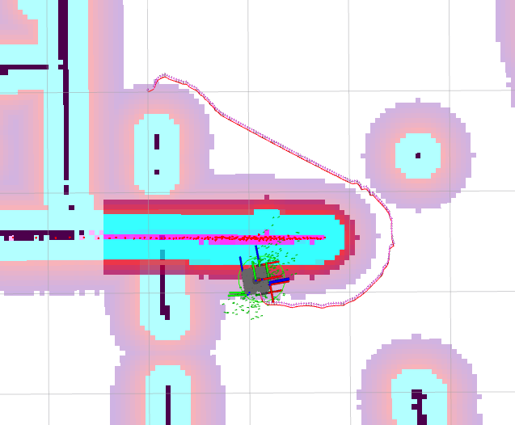

反馈信息如下：

```bash
Feedback:
    current_pose:
  header:
    stamp:
      sec: 1138
      nanosec: 538000000
    frame_id: map
  pose:
    position:
      x: 2.180823310769019
      y: 1.1390269773260406
      z: 0.009952321305022507
    orientation:
      x: 0.002579772630933317
      y: 0.0024296646375585027
      z: 0.10424760824741153
      w: 0.9945450606571912
navigation_time:
  sec: 75
  nanosec: 300000000
estimated_time_remaining:
  sec: 8
  nanosec: 523652104
number_of_recoveries: 7
distance_remaining: 0.23250165581703186

Result:
    result: {}

Goal finished with status: SUCCEEDED
```

编写`nav2pose.py`实现上述功能

```bash
from geometry_msgs.msg import PoseStamped
from nav2_simple_commander.robot_navigator import BasicNavigator, TaskResult
import rclpy
from rclpy.duration import Duration


def main():
    # 节点初始化
    rclpy.init()
    navigator = BasicNavigator()
    # 等待导航启动完成
    navigator.waitUntilNav2Active()
    # 设置目标点坐标
    goal_pose = PoseStamped()
    goal_pose.header.frame_id = 'map'
    goal_pose.header.stamp = navigator.get_clock().now().to_msg()
    goal_pose.pose.position.x = 3.0
    goal_pose.pose.position.y = 2.0
    goal_pose.pose.orientation.w = 1.0
    # 发送目标接收反馈结果
    navigator.goToPose(goal_pose)
    # 等待导航完成
    while not navigator.isTaskComplete():
        feedback = navigator.getFeedback()# 获取导航反馈
        navigator.get_logger().info(
            f'预计: {Duration.from_msg(feedback.estimated_time_remaining).nanoseconds / 1e9} s 后到达')
        # 超时自动取消
        if Duration.from_msg(feedback.navigation_time) > Duration(seconds=600.0):
            navigator.cancelTask()
    # 最终结果判断
    result = navigator.getResult()
    if result == TaskResult.SUCCEEDED:
        navigator.get_logger().info('导航结果：成功')
    elif result == TaskResult.CANCELED:
        navigator.get_logger().warn('导航结果：被取消')
    elif result == TaskResult.FAILED:
        navigator.get_logger().error('导航结果：失败')
    else:
        navigator.get_logger().error('导航结果：返回状态无效')

if __name__ == '__main__':
    main()
```

启动

```bash
conda activate ros2
cd /ros2-demo_ws
source install/setup.sh
ros2 launch student_starter_kit navigation.launch.py 
ros2 run student_starter_kit nav2pose 
```

结果如下：

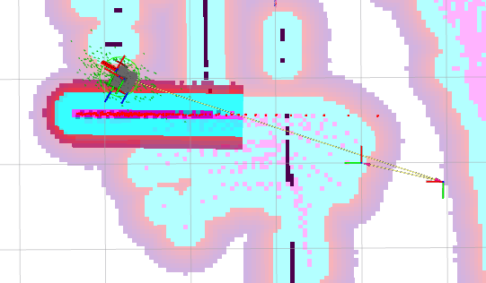

部分日志：

```bash
[INFO] [1773737573.664222752] [basic_navigator]: 预计: 1.318686697 s 后到达
[INFO] [1773737573.765987282] [basic_navigator]: 预计: 1.259035095 s 后到达
[INFO] [1773737573.874539279] [basic_navigator]: 预计: 1.197913984 s 后到达
[INFO] [1773737573.976352857] [basic_navigator]: 预计: 1.11724876 s 后到达
[INFO] [1773737574.077409597] [basic_navigator]: 预计: 1.647775979 s 后到达
[INFO] [1773737574.178246084] [basic_navigator]: 预计: 1.727459794 s 后到达
[INFO] [1773737574.280125692] [basic_navigator]: 预计: 1.767611774 s 后到达
[INFO] [1773737574.382734081] [basic_navigator]: 预计: 1.617185275 s 后到达
[INFO] [1773737574.484329352] [basic_navigator]: 预计: 1.606351261 s 后到达
[INFO] [1773737574.585864575] [basic_navigator]: 预计: 1.465992454 s 后到达
[INFO] [1773737574.688029634] [basic_navigator]: 预计: 1.187373139 s 后到达
[INFO] [1773737574.789140956] [basic_navigator]: 预计: 1.278589147 s 后到达
[INFO] [1773737574.890445458] [basic_navigator]: 预计: 1.106264801 s 后到达
[INFO] [1773737574.991524834] [basic_navigator]: 预计: 0.884877308 s 后到达
[INFO] [1773737575.046459844] [basic_navigator]: 导航结果：成功
```


## 使用接口完成多点导航

查看动作信息

```bash
ros2 action info /follow_waypoints -t
```

详细信息如下：

```bash
ros2 action info /follow_waypoints -t
Action: /follow_waypoints
Action clients: 1
    /rviz_navigation_dialog_action_client [nav2_msgs/action/FollowWaypoints]
Action servers: 1
    /waypoint_follower [nav2_msgs/action/FollowWaypoints]
```

查看这个消息接口的内容

```bash
ros2 interface show nav2_msgs/action/FollowWaypoints
```

内容如下

```bash
ros2 interface show nav2_msgs/action/FollowWaypoints
#goal definition
geometry_msgs/PoseStamped[] poses
        std_msgs/Header header
                builtin_interfaces/Time stamp
                        int32 sec
                        uint32 nanosec
                string frame_id
        Pose pose
                Point position
                        float64 x
                        float64 y
                        float64 z
                Quaternion orientation
                        float64 x 0
                        float64 y 0
                        float64 z 0
                        float64 w 1
---
#result definition
int32[] missed_waypoints
---
#feedback definition
uint32 current_waypoint
```

编写`waypoint_flollow.py`

```bash
from geometry_msgs.msg import PoseStamped
from nav2_simple_commander.robot_navigator import BasicNavigator, TaskResult
import rclpy
from rclpy.duration import Duration

def main():
    # 节点初始化
    rclpy.init()
    navigator = BasicNavigator()
    navigator.waitUntilNav2Active()
    # 创建点集
    goal_poses = []

    # 添加第一个点
    goal_pose1 = PoseStamped()
    goal_pose1.header.frame_id = 'map'
    goal_pose1.header.stamp = navigator.get_clock().now().to_msg()
    goal_pose1.pose.position.x = 1.0
    goal_pose1.pose.position.y = 1.0
    goal_pose1.pose.orientation.w = 1.0
    goal_poses.append(goal_pose1)

    # 添加第二个点
    goal_pose2 = PoseStamped()
    goal_pose2.header.frame_id = 'map'
    goal_pose2.header.stamp = navigator.get_clock().now().to_msg()
    goal_pose2.pose.position.x = 2.0
    goal_pose2.pose.position.y = 0.0
    goal_pose2.pose.orientation.w = 1.0
    goal_poses.append(goal_pose2)
    
    # 添加第三个点
    goal_pose3 = PoseStamped()
    goal_pose3.header.frame_id = 'map'
    goal_pose3.header.stamp = navigator.get_clock().now().to_msg()
    goal_pose3.pose.position.x = 2.0
    goal_pose3.pose.position.y = 2.0
    goal_pose3.pose.orientation.w = 1.0
    goal_poses.append(goal_pose3)
    
    # 调用路点导航服务
    navigator.followWaypoints(goal_poses)
    # 判断结束及获取反馈
    while not navigator.isTaskComplete():
        feedback = navigator.getFeedback()
        navigator.get_logger().info(
            f'当前目标编号：{feedback.current_waypoint}')
    # 最终结果判断
    result = navigator.getResult()
    if result == TaskResult.SUCCEEDED:
        navigator.get_logger().info('导航结果：成功')
    elif result == TaskResult.CANCELED:
        navigator.get_logger().warn('导航结果：被取消')
    elif result == TaskResult.FAILED:
        navigator.get_logger().error('导航结果：失败')
    else:
        navigator.get_logger().error('导航结果：返回状态无效')

if __name__ == '__main__':
    main()
```

启动

```bash
conda activate ros2
cd /ros2-demo_ws
source install/setup.sh
ros2 launch student_starter_kit navigation.launch.py 
ros2 run student_starter_kit waypoint_flollow
```


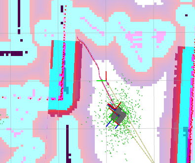

部分日志

```bash
[INFO] [1773739184.596055529] [basic_navigator]: 当前目标编号：2
[INFO] [1773739184.698319741] [basic_navigator]: 当前目标编号：2
[INFO] [1773739184.802513304] [basic_navigator]: 当前目标编号：2
[INFO] [1773739184.903708819] [basic_navigator]: 当前目标编号：2
[INFO] [1773739185.004697381] [basic_navigator]: 当前目标编号：2
[INFO] [1773739185.113900115] [basic_navigator]: 当前目标编号：2
[INFO] [1773739185.215075024] [basic_navigator]: 当前目标编号：2
[INFO] [1773739185.316069064] [basic_navigator]: 当前目标编号：2
[INFO] [1773739185.417033145] [basic_navigator]: 当前目标编号：2
[INFO] [1773739185.518776618] [basic_navigator]: 当前目标编号：2
[INFO] [1773739185.620295066] [basic_navigator]: 当前目标编号：2
[INFO] [1773739185.704334584] [basic_navigator]: 导航结果：成功
```

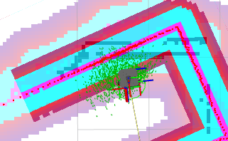

## 编写巡检控制节点

创建功能包

```bash
ros2 pkg create autopartol --build-type ament_python --dependencies rclpy nav2_simple_commander
```

语音合成和图像相关功能包

```bash
sudo apt install python3-pip  -y
sudo apt install espeak-ng -y
sudo pip3 install espeakng
sudo apt install ros-$ROS_DISTRO-tf-transformations
sudo pip3 install transforms3d
```

删除包中的`include`和`src`文件夹，创建`srv`文件夹

创建`Speech.srv`文件，此文件声明语音播报消息服务接口

```bash
string text    # 合成文字
---
bool result    # 合成结果
```


修改`CMakelists.txt`文件

```bash
# find dependencies
find_package(ament_cmake REQUIRED)
find_package(rosidl_default_generators REQUIRED)
rosidl_default_generators(${PROJECT_NAME}
  "srv/Speech.srv"

)
```

修改`package.xml`,声明功能包，大概在最后几行

```bash
  <export>
    <build_type>ament_cmake</build_type>
  </export>
  
  <member_of_group>rosidl_interface_packages</member_of_group>
</package>

```

编写语音合成服务节点

编写`speaker.py`

```bash
import rclpy
from rclpy.node import Node
from autopartol_interfaces.srv import Speech
import espeakng

class Speaker(Node):
    def __init__(self, node_name):
        super().__init__(node_name)
        # 创建服务端，服务类型为Speech，服务名称为'speech'，回调函数为self.speak_callback
        self.speech_service = self.create_service(
            Speech, 'speech', self.speak_callback)
        # 创建espeakng对象，设置语音为中文
        self.speaker = espeakng.Speaker()
        self.speaker.voice = 'zh'
        # 日志提示服务端已启动
        self.get_logger().info('服务端已启动，等待客户端请求')  

    # 服务回调函数，用于处理客户端请求
    def speak_callback(self, request, response):
        self.get_logger().info('正在朗读 %s' % request.text)
        self.speaker.say(request.text)# 朗读请求中的文本
        self.speaker.wait()
        response.result = True
        return response


def main(args=None):
    rclpy.init(args=args)
    node = Speaker('speaker')# 创建节点，节点名称为'speaker'
    rclpy.spin(node)
    rclpy.shutdown()
```

启动

```bash
conda activate ros2
cd /ros2-demo_ws
source install/setup.sh
ros2 launch student_starter_kit navigation.launch.py 
ros2 run autopartol speaker
```

查看服务列表，是否有Speech的服务

```bash
 ros2 service list
```

部分服务如下

```bash
/speaker/get_parameter_types
/speaker/get_parameters
/speaker/list_parameters
/speaker/set_parameters
/speaker/set_parameters_atomically
/speech
```

调用speech服务

```bash
ros2 service call /speech autopartol_interfaces/srv/Speech "{text: 你好}"
```

另一个终端显示

```bash
 ros2 run autopartol speaker
[INFO] [1773794443.500154625] [speaker]: 服务端已启动，等待客户端请求
[INFO] [1773794594.905329895] [speaker]: 正在朗读 你好
['espeak-ng', '-v', 'zh', '-s', '175', '-p', '50', '-a', '100', '-g', '0', '你好']
```


编写`partol_node.py`

```bash
import rclpy
from geometry_msgs.msg import PoseStamped, Pose
from nav2_simple_commander.robot_navigator import BasicNavigator, TaskResult
from tf2_ros import TransformListener, Buffer
from tf_transformations import euler_from_quaternion, quaternion_from_euler
from rclpy.duration import Duration
# 添加服务接口
from autopatrol_interfaces.srv import SpeachText
from sensor_msgs.msg import Image
from cv_bridge import CvBridge
import cv2

class PatrolNode(BasicNavigator):
    def __init__(self, node_name='patrol_node'):
        super().__init__(node_name)
        # 导航相关定义
        self.declare_parameter('initial_point', [0.0, 0.0, 0.0]) # 初始位置
        self.declare_parameter('target_points', [0.0, 0.0, 0.0, 1.0, 1.0, 1.57]) # 目标位置
        self.initial_point_ = self.get_parameter('initial_point').value
        self.target_points_ = self.get_parameter('target_points').value

        # 实时位置获取 TF 相关定义
        self.buffer_ = Buffer()
        self.listener_ = TransformListener(self.buffer_, self)
        self.speach_client_ = self.create_client(SpeachText, 'speech_text')

        # 订阅与保存图像相关定义
        self.declare_parameter('image_save_path', '')
        self.image_save_path = self.get_parameter('image_save_path').value
        self.bridge = CvBridge()
        self.latest_image = None
        self.subscription_image = self.create_subscription(
            Image, '/camera_sensor/image_raw', self.image_callback, 10)

    def image_callback(self, msg):
        """
        将最新的消息放到 latest_image 中
        """
        self.latest_image = msg

    def record_image(self):
        """
        记录图像
        """
        if self.latest_image is not None:
          pose = self.get_current_pose()
          cv_image = self.bridge.imgmsg_to_cv2(self.latest_image)
          cv2.imwrite(f'{self.image_save_path}image_{pose.translation.x:3.2f}_{pose.translation.y:3.2f}.png', cv_image)


    def speach_text(self, text):
        """
        调用服务播放语音
        """
        while not self.speach_client_.wait_for_service(timeout_sec=1.0):
            self.get_logger().info('语合成服务未上线，等待中。。。')

        request = SpeachText.Request()
        request.text = text
        future = self.speach_client_.call_async(request)
        rclpy.spin_until_future_complete(self, future)
        if future.result() is not None:
            result = future.result().result
            if result:
                self.get_logger().info(f'语音合成成功：{text}')
            else:
                self.get_logger().warn(f'语音合成失败：{text}')
        else:
            self.get_logger().warn('语音合成服务请求失败')

    def get_pose_by_xyyaw(self, x, y, yaw):
        """
        通过 x,y,yaw 合成 PoseStamped
        """
        pose = PoseStamped()  # 创建位姿消息
        pose.header.frame_id = 'map' # 位姿参考坐标系
        pose.pose.position.x = x # 位姿 x 坐标
        pose.pose.position.y = y # 位姿 y 坐标
        # 欧拉角转换为四元数
        rotation_quat = quaternion_from_euler(0, 0, yaw)
        pose.pose.orientation.x = rotation_quat[0]
        pose.pose.orientation.y = rotation_quat[1]
        pose.pose.orientation.z = rotation_quat[2]
        pose.pose.orientation.w = rotation_quat[3]
        return pose # 返回位姿

    def init_robot_pose(self):
        """
        初始化机器人位姿
        """
        # 从参数获取初始化点
        self.initial_point_ = self.get_parameter('initial_point').value
        # 合成位姿并进行初始化
        self.setInitialPose(self.get_pose_by_xyyaw(
            self.initial_point_[0], self.initial_point_[1], self.initial_point_[2]))
        # 等待直到导航激活
        self.waitUntilNav2Active()

    def get_target_points(self):
        """
        通过参数值获取目标点集合        
        """
        points = []
        self.target_points_ = self.get_parameter('target_points').value
        for index in range(int(len(self.target_points_)/3)):
            x = self.target_points_[index*3]
            y = self.target_points_[index*3+1]
            yaw = self.target_points_[index*3+2]
            points.append([x, y, yaw])
            self.get_logger().info(f'获取到目标点: {index}->({x},{y},{yaw})')
        return points

    def nav_to_pose(self, target_pose):
        """
        导航到指定位姿
        """
        self.waitUntilNav2Active()
        result = self.goToPose(target_pose)
        while not self.isTaskComplete():
            feedback = self.getFeedback()
            if feedback:
                self.get_logger().info(f'预计: {Duration.from_msg(feedback.estimated_time_remaining).nanoseconds / 1e9} s 后到达')
        # 最终结果判断
        result = self.getResult()
        if result == TaskResult.SUCCEEDED:
            self.get_logger().info('导航结果：成功')
        elif result == TaskResult.CANCELED:
            self.get_logger().warn('导航结果：被取消')
        elif result == TaskResult.FAILED:
            self.get_logger().error('导航结果：失败')
        else:
            self.get_logger().error('导航结果：返回状态无效')

    def get_current_pose(self):
        """
        通过TF获取当前位姿
        """
        while rclpy.ok():
            try:
                tf = self.buffer_.lookup_transform(
                    'map', 'base_footprint', rclpy.time.Time(seconds=0), rclpy.time.Duration(seconds=1))
                transform = tf.transform
                rotation_euler = euler_from_quaternion([
                    transform.rotation.x,
                    transform.rotation.y,
                    transform.rotation.z,
                    transform.rotation.w
                ])
                self.get_logger().info(
                    f'平移:{transform.translation},旋转四元数:{transform.rotation}:旋转欧拉角:{rotation_euler}')
                return transform
            except Exception as e:
                self.get_logger().warn(f'不能够获取坐标变换，原因: {str(e)}')
    
def main():
    rclpy.init()
    patrol = PatrolNode()
    patrol.speach_text(text='正在初始化位置')
    patrol.init_robot_pose()
    patrol.speach_text(text='位置初始化完成')

    while rclpy.ok():
        for point in patrol.get_target_points():
            x, y, yaw = point[0], point[1], point[2]
            # 导航到目标点
            target_pose = patrol.get_pose_by_xyyaw(x, y, yaw)
            patrol.speach_text(text=f'准备前往目标点{x},{y}')
            patrol.nav_to_pose(target_pose)
            patrol.speach_text(text=f"已到达目标点{x},{y},准备记录图像")
            patrol.record_image()
            patrol.speach_text(text=f"图像记录完成")
    rclpy.shutdown()

if __name__ == '__main__':
    main()

```

自动生成配置文件

```bash
ros2 param dump /partol_node
```

修改配置文件，设置导航点

```bash
patrol_node:
  ros__parameters:
    initial_point: [0.0, 0.0, 0.0]
    target_points: [
      0.0, 0.0, 0.0,
      1.0, 0.0, 3.14,
      1.0, 1.0, 1.57,
      0.0, 0.0, 1.57,
      1.5, 1.5, 3.14
      ]
```

启动

```bash
conda activate ros2
cd /ros2-demo_ws
source install/setup.sh
ros2 launch student_starter_kit navigation.launch.py 
ros2 run autopartol speaker
ros2 run autopartol partol_node --ros-args --param-file /home/qinghe/ros2-demo_ws/src/autopartol/config/partol_config.yaml
```

部分日志

```bash
(ros2) airsim@AIPhy:/home/qinghe/ros2-demo_ws$ ros2 run autopartol partol_node --ros-args --param-file /home/qinghe/ros2-demo_ws/src/autopartol/config/partol_config.yaml
[INFO] [1773795139.190924142] [patrol_node]: 加载参数文件：/home/qinghe/ros2-demo_ws/src/autopartol/config/partol_config.yaml
[INFO] [1773795139.192327421] [patrol_node]: 加载参数：initial_point = [0.0, 0.0, 0.0]
[INFO] [1773795139.192773951] [patrol_node]: 加载参数：target_points = [0.0, 0.0, 0.0, 1.0, 0.0, 3.14, 1.0, 1.0, 1.57, 0.0, 0.0, 1.57, 1.5, 1.5, 3.14]
[INFO] [1773795169.095008254] [patrol_node]: 语音合成成功：正在初始化位置
[INFO] [1773795169.095306154] [patrol_node]: 初始位置：[0.0, 0.0, 0.0]
[INFO] [1773795169.095937303] [patrol_node]: Publishing Initial Pose
[INFO] [1773795175.209751863] [patrol_node]: Nav2 is ready for use!
[INFO] [1773795175.210094845] [patrol_node]: Nav2 已激活
[INFO] [1773795204.228291894] [patrol_node]: 语音合成成功：位置初始化完成
[INFO] [1773795204.229060280] [patrol_node]: 目标点 0: (0.0, 0.0, 0.00 rad)
[INFO] [1773795204.230369055] [patrol_node]: 目标点 1: (1.0, 0.0, 3.14 rad)
[INFO] [1773795204.230631439] [patrol_node]: 目标点 2: (1.0, 1.0, 1.57 rad)
[INFO] [1773795204.231551844] [patrol_node]: 目标点 3: (0.0, 0.0, 1.57 rad)
[INFO] [1773795204.231795019] [patrol_node]: 目标点 4: (1.5, 1.5, 3.14 rad)
[INFO] [1773795233.273167606] [patrol_node]: 语音合成成功：准备前往目标点 0.0, 0.0
[INFO] [1773795237.291013788] [patrol_node]: Nav2 is ready for use!
[INFO] [1773795237.291715775] [patrol_node]: Navigating to goal: 0.0 0.0...
[INFO] [1773795237.377997353] [patrol_node]: 导航结果：成功
```

编写`autopartol.launch.py`

```bash
import os
import launch
import launch_ros
from ament_index_python.packages import get_package_share_directory
from launch.launch_description_sources import PythonLaunchDescriptionSource


def generate_launch_description():
    # 获取与拼接默认路径
    autopartol_dir = get_package_share_directory(
        'autopartol')
    patrol_config_path = os.path.join(
        autopartol_dir, 'config', 'partol_config.yaml')
    
    action_node_turtle_control = launch_ros.actions.Node(
        package='autopartol',
        executable='partol_node',
        parameters=[patrol_config_path]
    )
    action_node_patrol_client = launch_ros.actions.Node(
        package='autopartol',
        executable='speaker',
    )

    return launch.LaunchDescription([
        action_node_turtle_control,
        action_node_patrol_client,
    ])
```

修改`setup.py`

```bash
    data_files=[
        ('share/ament_index/resource_index/packages',
            ['resource/' + package_name]),
        ('share/' + package_name, ['package.xml']),
        ('share/' + package_name + '/config', ['config/partol_config.yaml']),
        ('share/' + package_name + '/launch', glob.glob('launch/*.launch.py')),

    ], 
```

启动

```bash
 ros2 launch autopartol autopartol.launch.py 
```

安装图片相关包

```bash
sudo apt install ros-$ROS_DISTRO-tf-transformations
sudo pip3 install transforms3d
```


## 调整导航参数

对`nav2_params.yaml`中部分参数进行调整

### 对路径跟踪参数进行调整

搜索`controller_server:`


修改`max_vel_theta`和`acc_lim_theta`

```bash
FollowPath:
      plugin: "dwb_core::DWBLocalPlanner"
      debug_trajectory_details: True
      min_vel_x: 0.0
      min_vel_y: 0.0
      max_vel_x: 0.26
      max_vel_y: 0.0
      max_vel_theta: 0.8 #最大旋转速度
      min_speed_xy: 0.0
      max_speed_xy: 0.26
      min_speed_theta: 0.0
      # Add high threshold velocity for turtlebot 3 issue.
      # https://github.com/ROBOTIS-GIT/turtlebot3_simulations/issues/75
      acc_lim_x: 2.5
      acc_lim_y: 0.0
      acc_lim_theta: 2.0 #最大旋转加速度
      decel_lim_x: -2.5
      decel_lim_y: 0.0
      decel_lim_theta: -3.2
      vx_samples: 20
      vy_samples: 5
      vtheta_samples: 20
      sim_time: 1.7
```

启动

```bash
conda activate ros2
cd /ros2-demo_ws
source install/setup.sh
ros2 launch student_starter_kit navigation.launch.py 
ros2 topic echo /cmd_vel
```

根据输出日志，可以发现最大角速度限制到`-0.8-0.8`

```bash
linear:
  x: 0.26
  y: 0.0
  z: 0.0
angular:
  x: 0.0
  y: 0.0
  z: -0.631578947368421
---
linear:
  x: 0.26
  y: 0.0
  z: 0.0
angular:
  x: 0.0
  y: 0.0
  z: -0.631578947368421
```

### 调整膨胀半径

在rviz中，可以看到机器人几乎要碰壁了

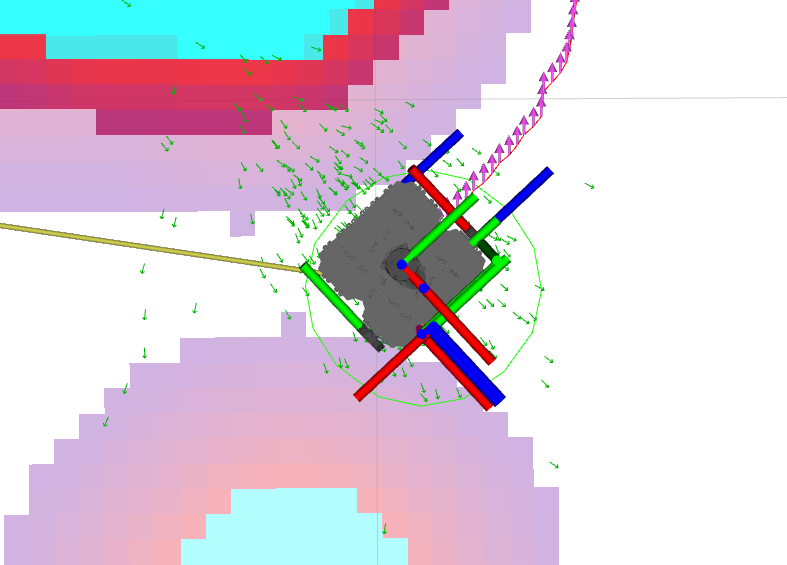

但是在gazebo中，其实机器人和墙壁还有一段很宽的距离

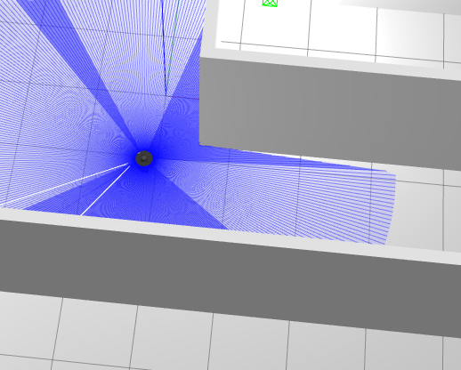

这时候需要调整膨胀半径,搜索`local_costmap`和 ，修改`inflation_radius`为0.2

```bash
local_costmap:
  local_costmap:
    ros__parameters:
      update_frequency: 5.0
      publish_frequency: 2.0
      global_frame: odom
      robot_base_frame: base_link
      use_sim_time: True
      rolling_window: true
      width: 3
      height: 3
      resolution: 0.05
      robot_radius: 0.22
      plugins: ["voxel_layer", "inflation_layer"]
      inflation_layer:
        plugin: "nav2_costmap_2d::InflationLayer"
        cost_scaling_factor: 3.0
        inflation_radius: 0.2 #膨胀半径
```

```bash
global_costmap:
  global_costmap:
    ros__parameters:
      update_frequency: 1.0
      publish_frequency: 1.0
      global_frame: map
      robot_base_frame: base_link
      use_sim_time: True
      robot_radius: 0.22
      resolution: 0.05 
      track_unknown_space: true
      plugins: ["static_layer", "obstacle_layer", "inflation_layer"]
      obstacle_layer:
        plugin: "nav2_costmap_2d::ObstacleLayer"
        enabled: True
        observation_sources: scan
        scan:
          topic: /scan
          max_obstacle_height: 2.0
          clearing: True
          marking: True
          data_type: "LaserScan"
          raytrace_max_range: 3.0
          raytrace_min_range: 0.0
          obstacle_max_range: 2.5
          obstacle_min_range: 0.0
      static_layer:
        plugin: "nav2_costmap_2d::StaticLayer"
        map_subscribe_transient_local: True
      inflation_layer:
        plugin: "nav2_costmap_2d::InflationLayer"
        cost_scaling_factor: 3.0
        inflation_radius: 0.2 #膨胀半径
      always_send_full_costmap: True
```

启动

```bash
conda activate ros2
cd /ros2-demo_ws
source install/setup.sh
ros2 launch student_starter_kit navigation.launch.py 
```

结果为

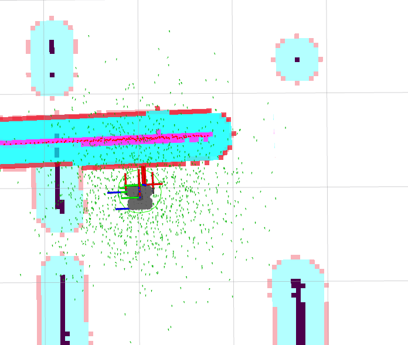

